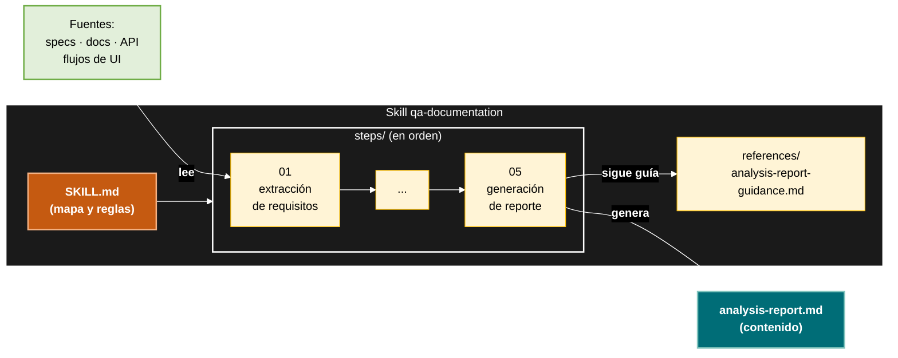

# qa-agents

Paquete npm que instala los **agentes QA de GitHub Copilot** en cualquier proyecto. El runtime no va dentro del paquete: el binario lo **descarga desde GitHub** (`pablotecat/qa-agents`) en cada ejecución. Los agentes, skills, instrucciones y prompts quedan en `.agents/`, listos para ser invocados desde Copilot.

Para futuras implementaciones y mejoras planeadas ver roadmap.md

## Instalación

### Modo 1 — Runner completo (recomendado para el pipeline QA)

Instala todo el runtime en `.agents/` (overwrite forzado, idempotente, sin confirmación interactiva):

```bash
npx qa-agents
```

### Modo 2 — Solo skills (estándar del ecosistema `skills`)

Instala únicamente las carpetas con `SKILL.md`. No instala `.agent.md`, `.instructions.md` ni `prompts/`:

```bash
npx skills add pablotecat/qa-agents
```

## Guía de uso

### Agentes

Cada agente orquesta uno o más skills de workflow, genera un reporte markdown y opcionalmente un work-log y un handoff JSON. Invócalos desde Copilot Chat usando `@<nombre-agente>` con el argumento hint descrito.

| Agente | Argumento hint | Qué hace | Salida principal |
|--------|----------------|----------|------------------|
| **QA.documentation** | solicitud QA y fuentes de requisitos (docs, specs, flujos UI/API) | Extrae, normaliza e identifica gaps en requisitos desde cualquier fuente | `QA.documentation-analysis-report.md` |
| **QA.planner** | handoff de QA.documentation con requisitos consolidados, dependencias y gaps | Diseña suites de prueba, modela cobertura y define precondiciones estructurales | `QA.planner-execution-summary.md` |
| **QA.generator** | handoff del planner o analysis-report de documentation con requisitos, suites y nombres de tests | Crea Test Cases con pasos numerados Given/When/Then | `QA.generator-test-cases.md` |
| **QA.prioritization** | artefactos de pruebas, planificación o requisitos con casos, riesgos y prerrequisitos | Evalúa riesgo, etiqueta smoke/regression, selecciona automatización y ordena ejecución manual | `prioritization-report.md` |

**Pipeline típico:** `QA.documentation` → `QA.planner` → `QA.generator` → `QA.prioritization`. Cada agente produce un handoff JSON que el siguiente puede consumir.

### Skills de workflow

Cada skill de workflow produce su reporte markdown de forma autónoma. Puedes invocarlas directamente vía slash command (modo standalone) sin pasar por un agente.

| Skill | Argumento hint | Descripción | Salida |
|-------|----------------|-------------|--------|
| **qa-documentation** | solicitud QA y fuentes de requisitos. Opcional: `to <path>`, `preview`/`no-save` | Extrae, normaliza y entrega requisitos consolidados | `analysis-report.md` |
| **qa-planner** | documentación con requisitos consolidados, dependencias y gaps. Opcional: `to <path>`, `preview`/`no-save` | Diseña suites de prueba, cobertura y precondiciones | `execution-summary.md` |
| **qa-generator** | documentación con requisitos, suites y nombres de tests. Opcional: `to <path>`, `preview`/`no-save` | Crea Test Cases con pasos Given/When/Then | `test-cases.md` |
| **qa-prioritization** | artefactos de pruebas, planificación o requisitos. Opcional: `to <path>`, `preview`/`no-save` | Prioriza pruebas, etiqueta smoke/regression, selecciona automatización | `prioritization-report.md` |

### Skills transversales

Estas skills complementan los workflows principales. Se invocan explícitamente según la necesidad.

| Skill | Argumento hint | Descripción |
|-------|----------------|-------------|
| **qa-worklog** | — | Construye la traza incremental de ejecución de un workflow QA. Los agentes la ejecutan automáticamente; en modo standalone es opcional. |
| **qa-handoff-creation** | nombre del agente productor, session id, rutas de summary_md/work_log_md | Genera el handoff JSON mínimo de cualquier agente productor. Solo se crea si el invocador decide llamarla una vez cerrado el workflow. |
| **agent-preferences** | agente objetivo, carpeta de sesión y feedback concreto sobre la ejecución | Calibra el comportamiento operativo de un agente QA después de una ejecución concreta, sin cambiar prompts ni contratos base. |

### Skill de referencia

| Skill | Descripción |
|-------|-------------|
| **playwright-best-practices** | Guía completa de mejores prácticas para Playwright (E2E, component, API, visual, accessibility, security testing). No es un workflow QA; se consulta como referencia al escribir o depurar tests. |
| **wcag-aa-guidance** | Guía operativa WCAG 2.2 A+AA para desarrollar, testear, revisar y remediar accesibilidad web. Enruta tareas Front y QA a requisitos, patrones, métodos de prueba y fuentes por guideline. |

### Rutas de salida

- **Vía agente** (pipeline QA): artefactos en `./tests/Documentation/sessions/session_{N}_{id}/QA-{agente}-agent/`.
- **Vía skill standalone** (sin agente):
  1. `to <path>` (o `save [to] <path>`, `en <path>`) → escribe ahí.
  2. `preview` o `no-save` → chat-only, nada en disco.
  3. Por defecto → `./qa-tmp/<skill-name>/<timestamp>/` (relativo al cwd).
## Estructura Agente


## Estructura Skill

## Estructura del paquete npm

El paquete publicado solo contiene binario y README; el runtime se descarga de GitHub en cada ejecución:

```text
.
├── bin/install.mjs     # binario ESM (Node ≥16.7, fs.cpSync) expuesto como `qa-agents`
├── package.json        # name: qa-agents, files: [bin/, README.md]
└── README.md
```

El campo `files` en `package.json` garantiza que el tarball incluya **solo** `bin/` y `README.md`. Las carpetas runtime (`agents/`, `instructions/`, `prompts/`, `scripts/`, `skills/`) **no se publican** pero **deben existir en el repo de GitHub** porque es lo que descarga el bin.
