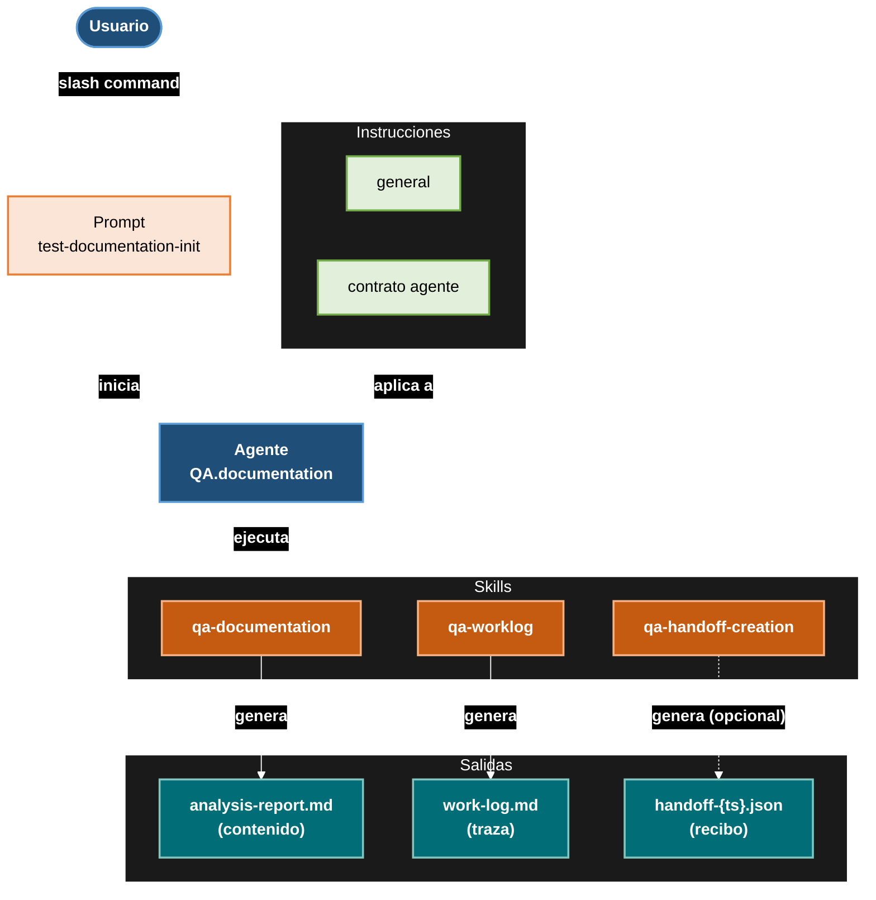
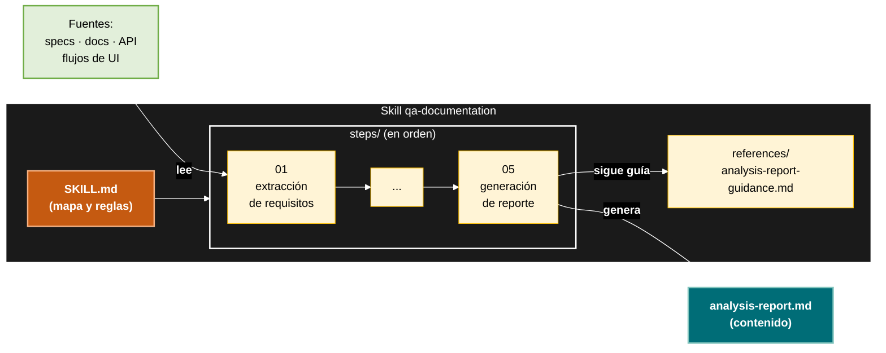

# qa-agents

Paquete npm que instala los **agentes QA de GitHub Copilot** en cualquier proyecto. El runtime no va dentro del paquete: el binario lo **descarga desde GitHub** (`pablotecat/qa-agents`) en cada ejecución. Los agentes, skills, instrucciones y prompts quedan en `.github/`, listos para ser invocados desde Copilot.

## Instalación

### Modo 1 — Runner completo (recomendado para el pipeline QA)

Instala todo el runtime en `.github/` (overwrite forzado, idempotente, sin confirmación interactiva):

```bash
npx qa-agents
```

### Modo 2 — Solo skills (estándar del ecosistema `skills`)

Instala únicamente las carpetas con `SKILL.md`. No instala `.agent.md`, `.instructions.md` ni `prompts/`:

```bash
npx skills add pablotecat/qa-agents
```

## Estructura Agente


## Estructura Skill

## Invocación

Cada skill de workflow produce su reporte markdown de forma autónoma. El handoff JSON y el worklog son **opcionales** y lo gestiona el invocador (agente o usuario) vía `qa-worklog` y `qa-handoff-creation` respectivamente.

- **Vía agente** (pipeline QA): isntala el paquete entero y llama al agente. Éste gestiona el worklog y handoff. Artefactos en `./tests/Documentation/sessions/`.
- **Vía skill standalone** (sin agente): slash command directo. Devuelve el reporte markdown sin handoff ni worklog. Artefactos en `./.qa-tmp/<skill-name>/<timestamp>/`, por defecto.

### Ruta de salida en modo standalone

1. `to <path>` (o `save [to] <path>`, `en <path>`) → escribe ahí.
2. `preview` o `no-save` → chat-only, nada en disco.
3. Default → `./qa-tmp/<skill-name>/<timestamp>/` (relativo al cwd).

Bajo `./tests/Documentation/sessions/`, cada agente crea su subcarpeta `QA-{agente}-agent/`. El primer agente en ejecutarse inicializa la carpeta de sesión y el contador.

## Estructura del paquete npm

El paquete publicado solo contiene binario y README; el runtime se descarga de GitHub en cada ejecución:

```text
.
├── bin/install.mjs     # binario ESM (Node ≥16.7, fs.cpSync) expuesto como `qa-agents`
├── package.json        # name: qa-agents, files: [bin/, README.md]
└── README.md
```

El campo `files` en `package.json` garantiza que el tarball incluya **solo** `bin/` y `README.md`. Las carpetas runtime (`agents/`, `instructions/`, `prompts/`, `skills/`) **no se publican** pero **deben existir en el repo de GitHub** porque es lo que descarga el bin.
