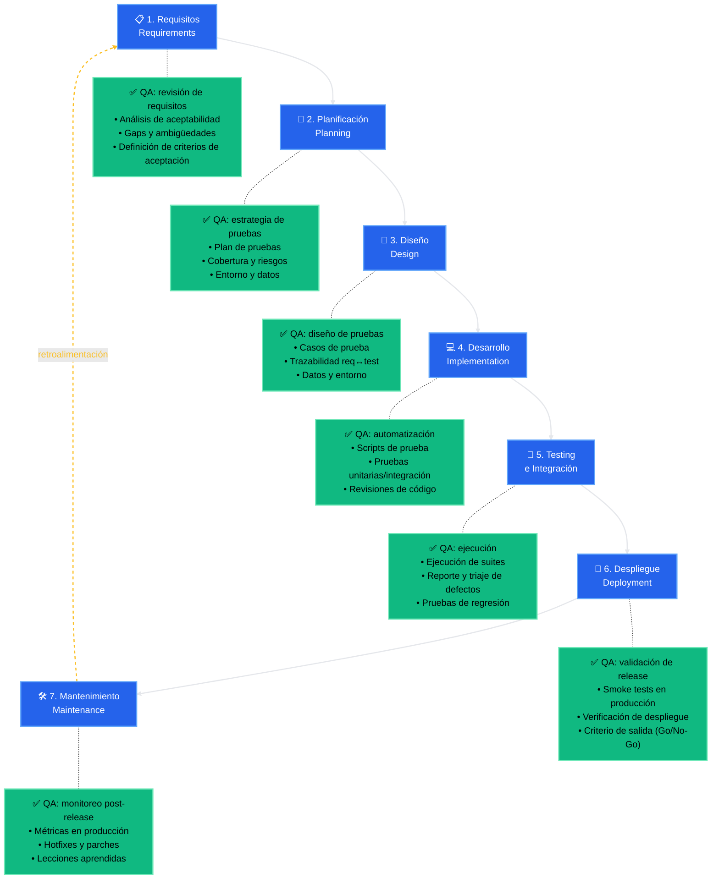

# Testing es responsabilidad de todo el equipo

El objetivo de QA no es "testear al final", sino acompañar el ciclo completo: defectos detectados en requisitos cuestan $1; en producción cuestan $1000+.

## ¿Qué validaciones debe seguir haciendo el humano? 

- Corregir y completar escenarios
- Decisiones de tiempos y recursos disponibles (Qué se puede ejecutar, qué tiene sentido automatizar)
- Testing de aspectos subjetivos de la aplicación (usabilidad, A11y, UI/UX, tono...)
- Falsos positivos y negativos
- Comunicación y mediación DEV/PO

