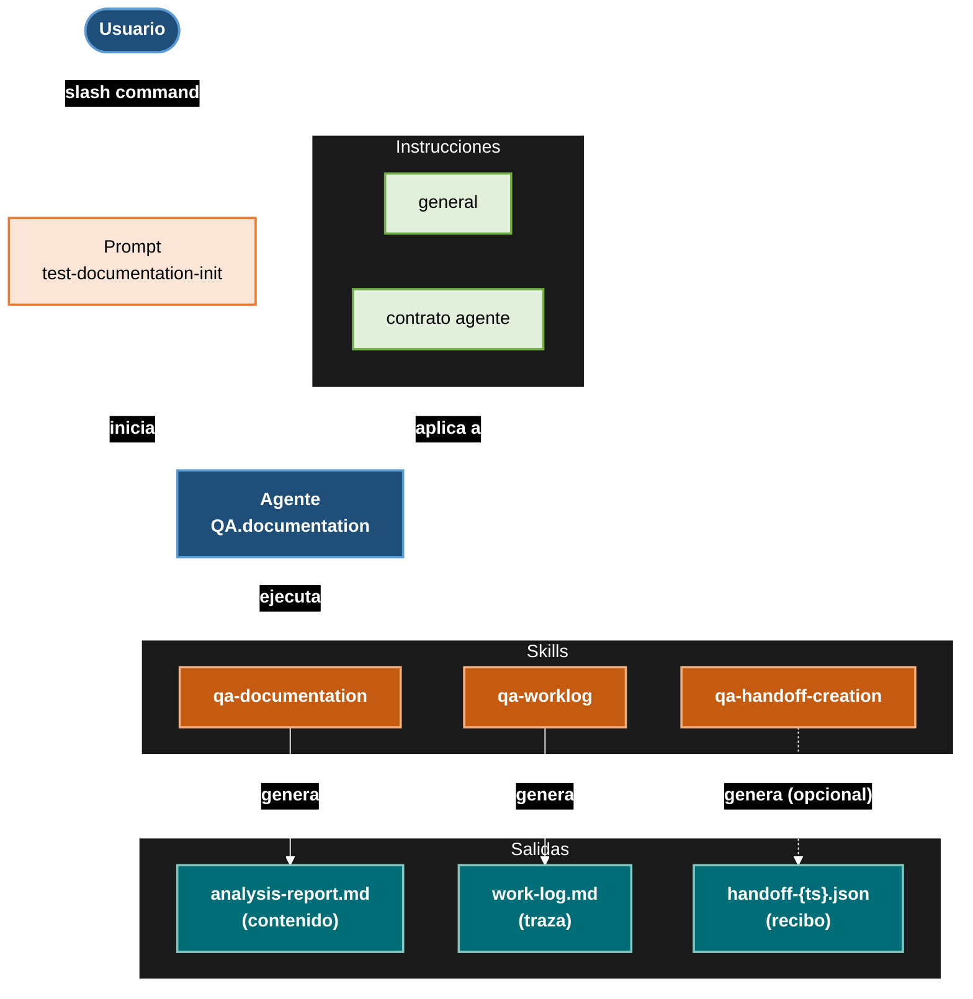

```mermaid
%%{init: {'theme': 'dark', 'themeVariables': { 'background': '#000000', 'primaryColor': '#1F4E79', 'edgeLabelBackground':'#000000', 'tertiaryColor': '#222', 'lineColor': '#FFFFFF', 'textColor': '#FFFFFF' }}}%%
flowchart TB
  %% ===== Estilos con alto contraste sobre fondo negro =====
  classDef agent fill:#1F4E79,color:#FFFFFF,stroke:#5B9BD5,stroke-width:2px,font-weight:bold
  classDef skill fill:#C55A11,color:#FFFFFF,stroke:#F4B183,stroke-width:2px,font-weight:bold
  classDef instr fill:#E2EFDA,color:#000000,stroke:#70AD47,stroke-width:2px
  classDef prompt fill:#FBE5D6,color:#000000,stroke:#ED7D31,stroke-width:2px
  classDef out fill:#006D77,color:#FFFFFF,stroke:#83C5BE,stroke-width:2px,font-weight:bold

  Usr(["Usuario"]):::agent
  P["Prompt<br/>test-documentation-init"]:::prompt
  Doc["Agente<br/>QA.documentation"]:::agent

  subgraph ins["Instrucciones"]
    direction LR
    I1["general"]:::instr
    I2["contrato agente"]:::instr
  end

  subgraph sks["Skills"]
    direction LR
    S1["qa-documentation"]:::skill
    S2["qa-worklog"]:::skill
    S3["qa-handoff-creation"]:::skill
  end

  subgraph outs["Salidas"]
    direction LR
    O1["analysis-report.md<br/>(contenido)"]:::out
    O2["work-log.md<br/>(traza)"]:::out
    O3["handoff-{ts}.json<br/>(recibo)"]:::out
  end

  Usr -->|slash command| P
  P -->|inicia| Doc
  ins -. aplica a .-> Doc
  Doc -->|ejecuta| sks
  S1 -->|genera| O1
  S2 -->|genera| O2
  S3 -. genera (opcional) .-> O3

  %% ===== Bordes y aristas en blanco para alto contraste sobre negro =====
  classDef subg fill:#1A1A1A,color:#FFFFFF,stroke:#FFFFFF,stroke-width:2px
  class ins,sks,leg,outs subg
  linkStyle default stroke:#FFFFFF,color:#FFFFFF,font-weight:bold
```