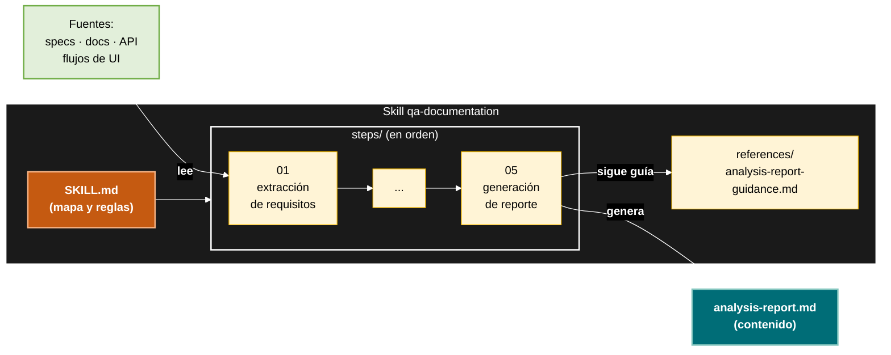

```mermaid
%%{init: {'theme': 'dark', 'themeVariables': { 'background': '#000000', 'primaryColor': '#1F4E79', 'edgeLabelBackground':'#000000', 'tertiaryColor': '#222', 'lineColor': '#FFFFFF', 'textColor': '#FFFFFF' }}}%%
flowchart LR
  %% ===== Estilos con alto contraste sobre fondo negro =====
  classDef skill fill:#C55A11,color:#FFFFFF,stroke:#F4B183,stroke-width:2px,font-weight:bold
  classDef file fill:#FFF4D6,color:#000000,stroke:#FFC000,stroke-width:1px
  classDef out fill:#006D77,color:#FFFFFF,stroke:#83C5BE,stroke-width:2px,font-weight:bold
  classDef input fill:#E2EFDA,color:#000000,stroke:#70AD47,stroke-width:2px
  classDef section fill:#1A1A1A,color:#FFFFFF,stroke:#FFFFFF,stroke-width:2px

  Input["Fuentes:<br/>specs · docs · API<br/>flujos de UI"]:::input

  subgraph skill["Skill qa-documentation"]
    direction TB
    SK["SKILL.md<br/>(mapa y reglas)"]:::skill
    subgraph steps["steps/ (en orden)"]
      direction LR
      S1["01<br/>extracción<br/>de requisitos"]:::file
      S2["..."]:::file
      S5["05<br/>generación<br/>de reporte"]:::file
    end
    Guidance["references/<br/>analysis-report-guidance.md"]:::file
    SK --> steps
    S1 --> S2 --> S5
  end

  Output["analysis-report.md<br/>(contenido)"]:::out

  Input -->|lee| S1
  S5 -->|sigue guía| Guidance
  S5 -->|genera| Output

  %% ===== Estilo de subgrafos =====
  class skill,steps section
  linkStyle default stroke:#FFFFFF,color:#FFFFFF,font-weight:bold
```